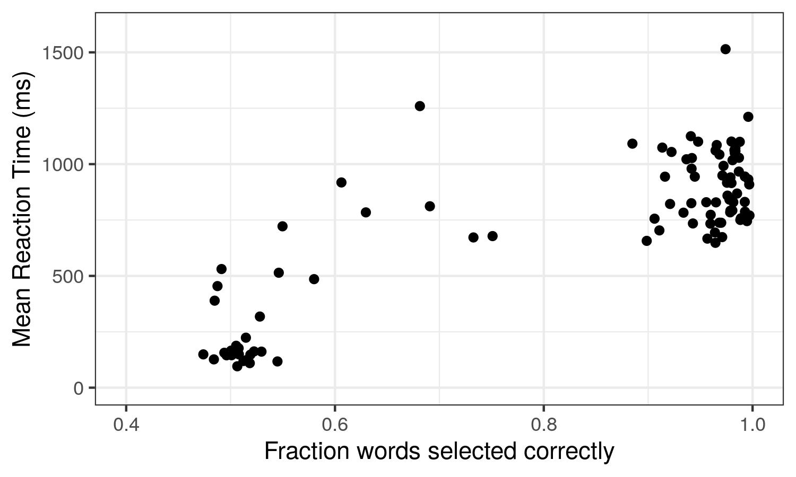

# Why I run experiments in 'redo' mode

The Maze task, as traditionally presented, does not tolerate mistakes. If you make a mistake and select the distractor instead of the correct word, you're done for that sentence. You see an error message, and start the next item. 

However, this can cause some problems. For one, if your distractors early in the sentence are often plausible, you lose a lot of data when many of your participants screw up on word two, and so you don't get any data from them for the rest of the sentence. For another, your item length is limited by how long people can get everything right, which makes multi-sentence items basically impossible. 

So, one potential fix for the first problem would be to write better distractors (with some combination of better programmatic choices and some hand-checking and editing). Or, we could just make Maze forgiving. 

The later approach, is, as it turns out, easy to code. When a mistake is made, instead of discontinuing the sentence, we display an error message, and wait until the participant clicks the correct button. Then, we continue with the sentence. We record the error, and both how long it took to click the wrong button and also how long until the correct button. In the Ibex implementation of Maze, the toggle for this is called 'redo', and you can turn it on for an entire set of items by adding the following near the top of your experimental file. 

```
var defaults = ["Maze", {redo: true}];
```
This leads to a Maze task that looks more like the following. (Selected words circles in blue.) 


I initially added this setting as a way to check materials (so, the experimenter could go through and note where things were iffy, continuing to check a sentence even after they misclicked), but I quickly convinced myself that this was just a better way to run experiments. 

For one, this gives me a much better idea of how participants are doing. I can get a better picture of how often participants are choosing correctly, because I have all their clicks, so it's easy to tell who is getting around 50% correct (and therefore randomly guessing) and exclude their data. There's no longer the confounding between worse distractors early in sentences and worse participants early in sentences (before the random clickers make mistakes and stop seeing the sentence). 

As an example, here's the correlation between accuracy on the Maze task (fraction of words chosen correctly) and mean RT on a recent experiment of 100 participants recruited from MTurk. As you can see, some participants jam the keys to get through the experiment quickly -- they have mean RT around 100-250 ms and accuracy around 50%, consistent with random guessing. We don't want data from these participants; it's useless. However, there's also a lot of participants with accuracy >90% range and RTs around 1 second. This is the data we want. By using redo mode, we can get good measures of accuracy (free from the confound of "did they make a mistake on word 2 because their error rate is 50% or because the distractor at word 2 was poor?") and use this to filter participants. I use 80% accuracy as the cut-off for including a participant's data in analyses. 



Additionally, I can run multi-sentence materials where information builds on previous sentences because even if they make mistakes, participants still saw all the information and can follow the text. 

I also can potentially use post-mistake data in analyses, which could increase the useable data considerable. Clearly, RT data from right after a mistake might be contaminated (who knows how mental processes involving errors might influence things), but at some point farther after a mistake it should be basically trustworthy. And if there happen to be a lot of errors at word 2, and the critical word is word 10, having that data for word 10 seems useful. 

Even if you don't analyse things after mistakes, it still probably makes for a better participant experience because mistakes don't feel so final. Being able to correct mistakes can mitigate both the accidental misclicking ('but I meant that other word') and plausible distractors ('it seemed like a fine continuation, why was it wrong?'). 

It's very easy to label and filter out data after mistakes, if you want to exclude it from analyses. The below R code shows how to label words that are after mistakes and remove words within 2 after a mistake. A similar approach could filter out all data after mistakes. 

```
data_filtered <- data %>% 
  mutate(word_num_mistake=ifelse(correct=="no", word_num,NA)) %>% #label the word number for errors
  group_by(sentence, subject) %>% 
  fill(word_num_mistake) %>% #within each grouping, propagate real values down over NAs
  ungroup() %>% 
  mutate(after_mistake=word_num-word_num_mistake, #calculate how many words since last mistake
         after_mistake=ifelse(is.na(after_mistake),0,after_mistake)) %>% #if before mistake, fill with 0
  filter(correct=="yes") %>% 
  filter(!after_mistake %in% c(1,2)) #filters out words one or two words after a mistake
```

# Redo mode with delay: aligning incentives

Redo mode as first implemented was a big improvement, but it doesn't fully address one issue: aligning incentives. We as researchers would like participants to do the tasks as intended, so that their responses are useable data and mean what we think they mean. In the case of Maze, that means we'd like participants to choose the correct word as quickly as they can and try to read as "normally" as possible in this non-natural task.

Crowdworkers who are being paid per task are financially incentivized to do the task as fast as possible so as to maximize earnings. Obviously, crowdworkers vary in their motivations for doing tasks, and many care about doing the task well and contributing to science. However, it's better if there's less of a gap between how fast one could complete the task and how long it takes to do the task as intended; as then those who do the task as intended aren't losing out by being cooperative, and thus who just want to do it quickly for the money will be likely to do it as intended, and thus contribute usable data.

Maze without redo is horrible on this metric: The efficient thing to do is press i (or e), and it's very efficient and painless! You make mistakes quickly, and skip to the next sentence, and repeat. There are on average 2 clicks / sentence (+ 1 to go to the next sentence). 

Maze with redo (but no delay) is better, but still not great. You now have to randomly jam i and e (maybe alternating) a lot. It's annoying, because you now have to press on average 1.5 keys per word per sentence, but it's still faster than doing the task.

Maze with delay could bring incentives into closer alignment. Now each time you make a mistake you have to wait a delay period (like 1 second) before your keypresses register again. This should substantially slow down the random clicking method, and make it more annoying. It will also slightly slow down the doing-the-intended-task method (mistakes happen). I hope that with maze-with-delay following the sentence context will feel like the better option compared to button jamming. 

## But what time delay to use?

This is new and I don't have any empirical evidence. 1000ms (the default) is arbitrary, but it's roughly on par with how long it takes to make a selection when doing the task as intended. It also seems like enough time to register that it says "incorrect", but not long enough to be stuck pondering "why was that wrong?" (important given that sometimes errors reflect bad distractors rather than inattention or misclicking) or lose the sentence context. It may turn out that this is too long and than a shorter delay like 500ms makes more sense. 

To change the delay just change the line to specify the time delay you want.
```
var defaults = ["Maze", {redo: true, time:500}];
```
You can also change the messages people see, both directly after the mistake when they can't select and when they are free to try again.
```
var defaults = ["Maze", {redo: true, emess:"Oops! Please wait...", rmess:"Now try again.!"}];
```
## On the topic of incentives...
One common way to align financial incentives with research goals is to use performance bonuses. One could consider rewarding participants for having a high accuracy rate. It might need to be carefully tuned so that participants don't slow down too much (trying to be too careful) or get too upset at inevitable mistakes from bad distractors. 

I have not tried this, but it should be straightforward to calculate error rates for each participant. 
