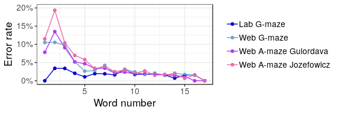
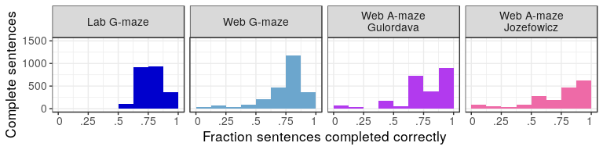
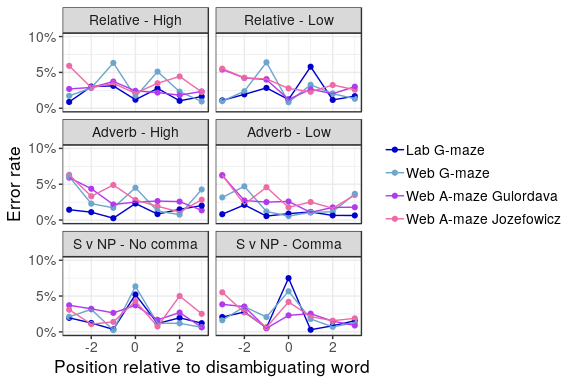

Error Rates
================

# Code

Functions:

  - process - reads in data, does participant exclusions

  - error\_rate - Preps data for looking for
    sentences/word\_positions/distractor combinations where there were
    high errors (usage: View(error\_rate(g\_maze))) will show
    searchable/filterable view)

  - error\_pos\_grouped - Used to set up for
    graph

<!-- end list -->

    ## Removed 14% participants who are not citizens, native speakers, or residents of the US.

    ## We have 44 participants left.

    ## Removed 33% of the data for being na (after a mistake).

    ## Removed 14% participants who are not citizens, native speakers, or residents of the US.

    ## We have 43 participants left.

    ## Removed 23% of the data for being na (after a mistake).

    ## Removed 6.1% participants who are not citizens, native speakers, or residents of the US.

    ## We have 46 participants left.

    ## Removed 33% of the data for being na (after a mistake).

    ## Removed 12% participants who are not citizens, native speakers, or residents of the US.

    ## We have 42 participants left.

    ## Removed 41% of the data for being na (after a mistake).

# Graphs from paper

    ## Adding missing grouping variables: `type`, `group`, `word`, `distractor`

<!-- -->

    ## Saving 6 x 2 in image

    ## Removed 14% participants who are not citizens, native speakers, or residents of the US.

    ## We have 44 participants left.

    ## Removed 33% of the data for being na (after a mistake).

    ## Removed 6.1% participants who are not citizens, native speakers, or residents of the US.

    ## We have 46 participants left.

    ## Removed 33% of the data for being na (after a mistake).

    ## Removed 12% participants who are not citizens, native speakers, or residents of the US.

    ## We have 42 participants left.

    ## Removed 41% of the data for being na (after a mistake).

<!-- -->

    ## Saving 8 x 2 in image

<!-- -->

    ## Saving 8 x 2 in image

# Differences in condition

    ## Adding missing grouping variables: `group`, `word`, `distractor`
    ## Adding missing grouping variables: `group`, `word`, `distractor`
    ## Adding missing grouping variables: `group`, `word`, `distractor`

<!-- -->

    ## Saving 6 x 4 in image
