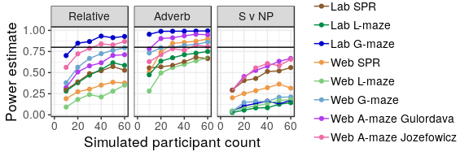

Power Analysis
================

# Code

# Get more accurate error rates

For the purpose of power analysis, we want to know a) how much possible
data existed at the critical word and b) how close to evenly distributed
it was (by participant, by item)

For our data, NA’s filled in, so can count up correct/total Their data
only has yes/no (not filled with NA from earlier mistake), so have to
hand calculate total – subject count \* 72 items

    ## # A tibble: 1 x 1
    ##   success_rate
    ##          <dbl>
    ## 1        0.848

    ## # A tibble: 1 x 1
    ##   success_rate
    ##          <dbl>
    ## 1        0.855

    ## # A tibble: 1 x 1
    ##   success_rate
    ##          <dbl>
    ## 1        0.593

    ## # A tibble: 1 x 1
    ##   success_rate
    ##          <dbl>
    ## 1        0.709

    ## # A tibble: 1 x 1
    ##   success_rate
    ##          <dbl>
    ## 1        0.584

    ## # A tibble: 1 x 1
    ##   success_rate
    ##          <dbl>
    ## 1        0.504

    ## # A tibble: 1 x 2
    ##     avg     sd
    ##   <dbl>  <dbl>
    ## 1 0.592 0.0552

    ## # A tibble: 1 x 2
    ##     avg     sd
    ##   <dbl>  <dbl>
    ## 1 0.704 0.0610

    ## # A tibble: 1 x 2
    ##     avg     sd
    ##   <dbl>  <dbl>
    ## 1 0.585 0.0671

    ## # A tibble: 1 x 2
    ##     avg     sd
    ##   <dbl>  <dbl>
    ## 1 0.499 0.0697

    ## # A tibble: 1 x 2
    ##     avg    sd
    ##   <dbl> <dbl>
    ## 1 0.593 0.357

    ## # A tibble: 1 x 2
    ##     avg    sd
    ##   <dbl> <dbl>
    ## 1 0.709 0.273

    ## # A tibble: 1 x 2
    ##     avg    sd
    ##   <dbl> <dbl>
    ## 1 0.584 0.367

    ## # A tibble: 1 x 2
    ##     avg    sd
    ##   <dbl> <dbl>
    ## 1 0.504 0.384

    ## # A tibble: 1 x 2
    ##     avg     sd
    ##   <dbl>  <dbl>
    ## 1 0.848 0.0660

    ## # A tibble: 1 x 2
    ##     avg    sd
    ##   <dbl> <dbl>
    ## 1 0.855 0.108

Used error rates & sd: - Web G-maze:

Set-up section (copied from results.Rmd)

  - process\_data - reads in data and does exclusions
  - process\_spr - reads in SPR data and does exclusions
  - for\_model - relabels for word position, selects one type of
    sentence

Power analysis functions:

  - get\_sided\_log\_power\_est - runs a maximal lmer model; then 500
    times, simulates data from the posterior, runs model on fake data
    and checks for significance in desired direction
  - for\_power - filters data for critical word position
  - for\_spr\_power - sums 0-3 word region for SPR

# Running analysis

Error rates:

  - our G-maze - .4 data loss, .36 sd
  - our Gulordava - .42 data loss, .37 sd
  - our one-b - .5 data loss, .38 sd
  - our L-maze - .29 data loss, .27 sd
  - our SPR (0 error, exclude .25 of participants)
  - their G-maze - .15 loss, .07 sd
  - their L-maze .15 loss, .11 sd
  - their SPR (0 error, no exclusions)

# Make graph

<!-- -->

    ## Saving 6 x 2 in image
