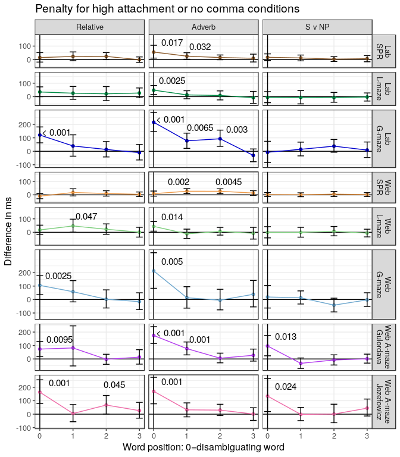

Main Analysis
================

Analysis code
=============

Functions:

-   process\_data - reads in data and does exclusions
-   process\_spr - reads in SPR data and does exclusions
-   for\_model - relabels for word position, selects one type of sentence
-   brm\_modelling - does actual modelling

Run analysis for relative clauses

Run analysis for adverbs

Run analysis for NP v S

Re-analyse Witzel data

Graph for paper
===============

    ## Saving 7 x 8 in image

Fuller results
==============

For each word position, from -5 to 5 (disambiguating/critical word is 0). Estimated effect size in ms (of dispreferred - preferred). P-value equivalent given in parentheses.

Relative Clause Results
-----------------------

Relative clause attatchment: (always using reflexive pronouns)

-   The son of the actress who shot *herself* on the set was under investigation. (low attachment) versus
-   The son of the actress who shot *himself* on the set was under investigation. (high attatchment)

Here word position is measured off of where the reflexive it was. So 'herself' or 'himself' is 0, the following word is 1, the preceding word is -1 etc.

<table>
<thead>
<tr>
<th style="text-align:left;">
Word Position
</th>
<th style="text-align:left;">
Lab SPR
</th>
<th style="text-align:left;">
Lab L-maze
</th>
<th style="text-align:left;">
Lab G-maze
</th>
<th style="text-align:left;">
Web SPR
</th>
<th style="text-align:left;">
Web L-maze
</th>
<th style="text-align:left;">
Web G-maze
</th>
<th style="text-align:left;">
Web A-maze Gulordava
</th>
<th style="text-align:left;">
Web A-maze Jozefowicz
</th>
</tr>
</thead>
<tbody>
<tr>
<td style="text-align:left;">
-5
</td>
<td style="text-align:left;">
-4 (0.65)
</td>
<td style="text-align:left;">
16 (0.17)
</td>
<td style="text-align:left;">
3 (0.89)
</td>
<td style="text-align:left;">
-10 (0.23)
</td>
<td style="text-align:left;">
-7 (0.67)
</td>
<td style="text-align:left;">
-3 (0.9)
</td>
<td style="text-align:left;">
10 (0.53)
</td>
<td style="text-align:left;">
-11 (0.56)
</td>
</tr>
<tr>
<td style="text-align:left;">
-4
</td>
<td style="text-align:left;">
4 (0.7)
</td>
<td style="text-align:left;">
-10 (0.58)
</td>
<td style="text-align:left;">
-4 (0.85)
</td>
<td style="text-align:left;">
2 (0.8)
</td>
<td style="text-align:left;">
22 (0.19)
</td>
<td style="text-align:left;">
7 (0.71)
</td>
<td style="text-align:left;">
-10 (0.63)
</td>
<td style="text-align:left;">
-8 (0.57)
</td>
</tr>
<tr>
<td style="text-align:left;">
-3
</td>
<td style="text-align:left;">
6 (0.64)
</td>
<td style="text-align:left;">
-1 (0.95)
</td>
<td style="text-align:left;">
37 (0.099)
</td>
<td style="text-align:left;">
-10 (0.26)
</td>
<td style="text-align:left;">
13 (0.49)
</td>
<td style="text-align:left;">
-8 (0.72)
</td>
<td style="text-align:left;">
-14 (0.39)
</td>
<td style="text-align:left;">
-20 (0.48)
</td>
</tr>
<tr>
<td style="text-align:left;">
-2
</td>
<td style="text-align:left;">
2 (0.87)
</td>
<td style="text-align:left;">
2 (0.88)
</td>
<td style="text-align:left;">
-31 (0.33)
</td>
<td style="text-align:left;">
-10 (0.29)
</td>
<td style="text-align:left;">
17 (0.33)
</td>
<td style="text-align:left;">
-1 (0.99)
</td>
<td style="text-align:left;">
16 (0.42)
</td>
<td style="text-align:left;">
-2 (0.92)
</td>
</tr>
<tr>
<td style="text-align:left;">
-1
</td>
<td style="text-align:left;">
6 (0.7)
</td>
<td style="text-align:left;">
-11 (0.63)
</td>
<td style="text-align:left;">
-33 (0.3)
</td>
<td style="text-align:left;">
-7 (0.48)
</td>
<td style="text-align:left;">
14 (0.46)
</td>
<td style="text-align:left;">
-44 (0.22)
</td>
<td style="text-align:left;">
35 (0.21)
</td>
<td style="text-align:left;">
-14 (0.68)
</td>
</tr>
<tr>
<td style="text-align:left;">
0
</td>
<td style="text-align:left;">
15 (0.39)
</td>
<td style="text-align:left;">
35 (0.051)
</td>
<td style="text-align:left;">
121 (0)
</td>
<td style="text-align:left;">
-10 (0.31)
</td>
<td style="text-align:left;">
18 (0.32)
</td>
<td style="text-align:left;">
105 (0.0025)
</td>
<td style="text-align:left;">
73 (0.0095)
</td>
<td style="text-align:left;">
163 (0.001)
</td>
</tr>
<tr>
<td style="text-align:left;">
1
</td>
<td style="text-align:left;">
23 (0.15)
</td>
<td style="text-align:left;">
26 (0.27)
</td>
<td style="text-align:left;">
39 (0.33)
</td>
<td style="text-align:left;">
17 (0.17)
</td>
<td style="text-align:left;">
47 (0.047)
</td>
<td style="text-align:left;">
58 (0.14)
</td>
<td style="text-align:left;">
82 (0.23)
</td>
<td style="text-align:left;">
5 (0.88)
</td>
</tr>
<tr>
<td style="text-align:left;">
2
</td>
<td style="text-align:left;">
24 (0.063)
</td>
<td style="text-align:left;">
21 (0.43)
</td>
<td style="text-align:left;">
14 (0.61)
</td>
<td style="text-align:left;">
10 (0.3)
</td>
<td style="text-align:left;">
23 (0.22)
</td>
<td style="text-align:left;">
2 (0.96)
</td>
<td style="text-align:left;">
-2 (0.9)
</td>
<td style="text-align:left;">
68 (0.045)
</td>
</tr>
<tr>
<td style="text-align:left;">
3
</td>
<td style="text-align:left;">
-2 (0.85)
</td>
<td style="text-align:left;">
27 (0.13)
</td>
<td style="text-align:left;">
-10 (0.71)
</td>
<td style="text-align:left;">
4 (0.68)
</td>
<td style="text-align:left;">
1 (0.95)
</td>
<td style="text-align:left;">
-15 (0.61)
</td>
<td style="text-align:left;">
14 (0.58)
</td>
<td style="text-align:left;">
26 (0.34)
</td>
</tr>
<tr>
<td style="text-align:left;">
4
</td>
<td style="text-align:left;">
-11 (0.29)
</td>
<td style="text-align:left;">
-8 (0.72)
</td>
<td style="text-align:left;">
-51 (0.059)
</td>
<td style="text-align:left;">
1 (0.89)
</td>
<td style="text-align:left;">
-4 (0.8)
</td>
<td style="text-align:left;">
-51 (0.19)
</td>
<td style="text-align:left;">
17 (0.45)
</td>
<td style="text-align:left;">
17 (0.49)
</td>
</tr>
<tr>
<td style="text-align:left;">
5
</td>
<td style="text-align:left;">
-3 (0.77)
</td>
<td style="text-align:left;">
19 (0.32)
</td>
<td style="text-align:left;">
-9 (0.76)
</td>
<td style="text-align:left;">
14 (0.23)
</td>
<td style="text-align:left;">
56 (0.052)
</td>
<td style="text-align:left;">
-22 (0.62)
</td>
<td style="text-align:left;">
-16 (0.49)
</td>
<td style="text-align:left;">
20 (0.56)
</td>
</tr>
</tbody>
</table>
Adverb Results
--------------

Adverb attatchment: (always temporal adverbs)

-   Susan bought the wine she will drink *next week*, but she didn't buy any cheese. (low attachment) versus
-   Susan bought the wine she will drink *last week*, but she didn't buy any cheese. (high attachment)

Here word position is measured by how many words after the temporal adjective it was. So 'last' 'next', 'week', and 'tomorrow' would all be 0, 'but' is 1 etc.

<table>
<thead>
<tr>
<th style="text-align:left;">
Word Position
</th>
<th style="text-align:left;">
Lab SPR
</th>
<th style="text-align:left;">
Lab L-maze
</th>
<th style="text-align:left;">
Lab G-maze
</th>
<th style="text-align:left;">
Web SPR
</th>
<th style="text-align:left;">
Web L-maze
</th>
<th style="text-align:left;">
Web G-maze
</th>
<th style="text-align:left;">
Web A-maze Gulordava
</th>
<th style="text-align:left;">
Web A-maze Jozefowicz
</th>
</tr>
</thead>
<tbody>
<tr>
<td style="text-align:left;">
-5
</td>
<td style="text-align:left;">
0 (0.98)
</td>
<td style="text-align:left;">
-3 (0.84)
</td>
<td style="text-align:left;">
-12 (0.57)
</td>
<td style="text-align:left;">
5 (0.53)
</td>
<td style="text-align:left;">
-1 (0.99)
</td>
<td style="text-align:left;">
-31 (0.5)
</td>
<td style="text-align:left;">
-9 (0.66)
</td>
<td style="text-align:left;">
2 (0.94)
</td>
</tr>
<tr>
<td style="text-align:left;">
-4
</td>
<td style="text-align:left;">
15 (0.19)
</td>
<td style="text-align:left;">
9 (0.51)
</td>
<td style="text-align:left;">
-12 (0.51)
</td>
<td style="text-align:left;">
4 (0.57)
</td>
<td style="text-align:left;">
7 (0.74)
</td>
<td style="text-align:left;">
-22 (0.46)
</td>
<td style="text-align:left;">
-15 (0.4)
</td>
<td style="text-align:left;">
11 (0.61)
</td>
</tr>
<tr>
<td style="text-align:left;">
-3
</td>
<td style="text-align:left;">
-1 (0.95)
</td>
<td style="text-align:left;">
18 (0.28)
</td>
<td style="text-align:left;">
12 (0.68)
</td>
<td style="text-align:left;">
0 (0.97)
</td>
<td style="text-align:left;">
8 (0.59)
</td>
<td style="text-align:left;">
-64 (0.15)
</td>
<td style="text-align:left;">
9 (0.7)
</td>
<td style="text-align:left;">
14 (0.61)
</td>
</tr>
<tr>
<td style="text-align:left;">
-2
</td>
<td style="text-align:left;">
18 (0.048)
</td>
<td style="text-align:left;">
-8 (0.7)
</td>
<td style="text-align:left;">
33 (0.27)
</td>
<td style="text-align:left;">
-14 (0.092)
</td>
<td style="text-align:left;">
-24 (0.24)
</td>
<td style="text-align:left;">
0 (0.98)
</td>
<td style="text-align:left;">
32 (0.2)
</td>
<td style="text-align:left;">
16 (0.59)
</td>
</tr>
<tr>
<td style="text-align:left;">
-1
</td>
<td style="text-align:left;">
8 (0.45)
</td>
<td style="text-align:left;">
-10 (0.57)
</td>
<td style="text-align:left;">
-17 (0.42)
</td>
<td style="text-align:left;">
-8 (0.34)
</td>
<td style="text-align:left;">
-15 (0.36)
</td>
<td style="text-align:left;">
-3 (0.94)
</td>
<td style="text-align:left;">
18 (0.41)
</td>
<td style="text-align:left;">
-26 (0.33)
</td>
</tr>
<tr>
<td style="text-align:left;">
0
</td>
<td style="text-align:left;">
56 (0.017)
</td>
<td style="text-align:left;">
48 (0.0025)
</td>
<td style="text-align:left;">
216 (0)
</td>
<td style="text-align:left;">
9 (0.33)
</td>
<td style="text-align:left;">
44 (0.014)
</td>
<td style="text-align:left;">
213 (0.005)
</td>
<td style="text-align:left;">
175 (0)
</td>
<td style="text-align:left;">
170 (0.001)
</td>
</tr>
<tr>
<td style="text-align:left;">
1
</td>
<td style="text-align:left;">
25 (0.032)
</td>
<td style="text-align:left;">
13 (0.4)
</td>
<td style="text-align:left;">
78 (0.0065)
</td>
<td style="text-align:left;">
27 (0.002)
</td>
<td style="text-align:left;">
-11 (0.5)
</td>
<td style="text-align:left;">
13 (0.72)
</td>
<td style="text-align:left;">
77 (0.001)
</td>
<td style="text-align:left;">
32 (0.22)
</td>
</tr>
<tr>
<td style="text-align:left;">
2
</td>
<td style="text-align:left;">
15 (0.083)
</td>
<td style="text-align:left;">
9 (0.62)
</td>
<td style="text-align:left;">
93 (0.003)
</td>
<td style="text-align:left;">
27 (0.0045)
</td>
<td style="text-align:left;">
7 (0.62)
</td>
<td style="text-align:left;">
-5 (0.89)
</td>
<td style="text-align:left;">
6 (0.76)
</td>
<td style="text-align:left;">
30 (0.15)
</td>
</tr>
<tr>
<td style="text-align:left;">
3
</td>
<td style="text-align:left;">
9 (0.48)
</td>
<td style="text-align:left;">
-8 (0.72)
</td>
<td style="text-align:left;">
-30 (0.22)
</td>
<td style="text-align:left;">
14 (0.12)
</td>
<td style="text-align:left;">
-7 (0.73)
</td>
<td style="text-align:left;">
39 (0.41)
</td>
<td style="text-align:left;">
27 (0.23)
</td>
<td style="text-align:left;">
1 (0.95)
</td>
</tr>
<tr>
<td style="text-align:left;">
4
</td>
<td style="text-align:left;">
13 (0.093)
</td>
<td style="text-align:left;">
3 (0.88)
</td>
<td style="text-align:left;">
23 (0.35)
</td>
<td style="text-align:left;">
15 (0.02)
</td>
<td style="text-align:left;">
-41 (0.054)
</td>
<td style="text-align:left;">
41 (0.18)
</td>
<td style="text-align:left;">
0 (1)
</td>
<td style="text-align:left;">
12 (0.66)
</td>
</tr>
<tr>
<td style="text-align:left;">
5
</td>
<td style="text-align:left;">
8 (0.32)
</td>
<td style="text-align:left;">
16 (0.29)
</td>
<td style="text-align:left;">
20 (0.4)
</td>
<td style="text-align:left;">
10 (0.19)
</td>
<td style="text-align:left;">
-2 (0.91)
</td>
<td style="text-align:left;">
30 (0.37)
</td>
<td style="text-align:left;">
-15 (0.42)
</td>
<td style="text-align:left;">
-41 (0.11)
</td>
</tr>
</tbody>
</table>
S v NP conjunction Results
--------------------------

NP/S coordination:

-   the robber shot the jeweler, and the salesman *reported* the crime to the police. (unambiguous due to comma) versus
-   the robber shot the jeweler and the salesman *reported* the crime to the police. (ambiguous)

Here position is sentence is measured relative to the second verb (disambiguation). So 'reported' is 0, 'the' is 1 etc.

<table>
<thead>
<tr>
<th style="text-align:left;">
Word Position
</th>
<th style="text-align:left;">
Lab SPR
</th>
<th style="text-align:left;">
Lab L-maze
</th>
<th style="text-align:left;">
Lab G-maze
</th>
<th style="text-align:left;">
Web SPR
</th>
<th style="text-align:left;">
Web L-maze
</th>
<th style="text-align:left;">
Web G-maze
</th>
<th style="text-align:left;">
Web A-maze Gulordava
</th>
<th style="text-align:left;">
Web A-maze Jozefowicz
</th>
</tr>
</thead>
<tbody>
<tr>
<td style="text-align:left;">
-5
</td>
<td style="text-align:left;">
5 (0.59)
</td>
<td style="text-align:left;">
9 (0.5)
</td>
<td style="text-align:left;">
-6 (0.8)
</td>
<td style="text-align:left;">
6 (0.39)
</td>
<td style="text-align:left;">
12 (0.49)
</td>
<td style="text-align:left;">
-31 (0.29)
</td>
<td style="text-align:left;">
-1 (0.96)
</td>
<td style="text-align:left;">
-10 (0.73)
</td>
</tr>
<tr>
<td style="text-align:left;">
-4
</td>
<td style="text-align:left;">
-69 (0.0045)
</td>
<td style="text-align:left;">
5 (0.76)
</td>
<td style="text-align:left;">
2 (0.93)
</td>
<td style="text-align:left;">
-5 (0.57)
</td>
<td style="text-align:left;">
-28 (0.17)
</td>
<td style="text-align:left;">
2 (0.94)
</td>
<td style="text-align:left;">
-25 (0.46)
</td>
<td style="text-align:left;">
-55 (0.11)
</td>
</tr>
<tr>
<td style="text-align:left;">
-3
</td>
<td style="text-align:left;">
-9 (0.37)
</td>
<td style="text-align:left;">
-32 (0.024)
</td>
<td style="text-align:left;">
-17 (0.42)
</td>
<td style="text-align:left;">
-14 (0.064)
</td>
<td style="text-align:left;">
-25 (0.078)
</td>
<td style="text-align:left;">
-14 (0.6)
</td>
<td style="text-align:left;">
-6 (0.75)
</td>
<td style="text-align:left;">
4 (0.87)
</td>
</tr>
<tr>
<td style="text-align:left;">
-2
</td>
<td style="text-align:left;">
11 (0.15)
</td>
<td style="text-align:left;">
-28 (0.078)
</td>
<td style="text-align:left;">
-46 (0.054)
</td>
<td style="text-align:left;">
2 (0.82)
</td>
<td style="text-align:left;">
-23 (0.18)
</td>
<td style="text-align:left;">
-24 (0.37)
</td>
<td style="text-align:left;">
-12 (0.42)
</td>
<td style="text-align:left;">
5 (0.86)
</td>
</tr>
<tr>
<td style="text-align:left;">
-1
</td>
<td style="text-align:left;">
7 (0.48)
</td>
<td style="text-align:left;">
-13 (0.47)
</td>
<td style="text-align:left;">
-6 (0.82)
</td>
<td style="text-align:left;">
2 (0.75)
</td>
<td style="text-align:left;">
-33 (0.071)
</td>
<td style="text-align:left;">
-38 (0.09)
</td>
<td style="text-align:left;">
-10 (0.54)
</td>
<td style="text-align:left;">
-32 (0.3)
</td>
</tr>
<tr>
<td style="text-align:left;">
0
</td>
<td style="text-align:left;">
17 (0.17)
</td>
<td style="text-align:left;">
-5 (0.81)
</td>
<td style="text-align:left;">
-7 (0.86)
</td>
<td style="text-align:left;">
2 (0.82)
</td>
<td style="text-align:left;">
-1 (0.98)
</td>
<td style="text-align:left;">
19 (0.65)
</td>
<td style="text-align:left;">
96 (0.013)
</td>
<td style="text-align:left;">
134 (0.024)
</td>
</tr>
<tr>
<td style="text-align:left;">
1
</td>
<td style="text-align:left;">
12 (0.28)
</td>
<td style="text-align:left;">
-6 (0.82)
</td>
<td style="text-align:left;">
15 (0.58)
</td>
<td style="text-align:left;">
0 (0.98)
</td>
<td style="text-align:left;">
0 (0.99)
</td>
<td style="text-align:left;">
13 (0.6)
</td>
<td style="text-align:left;">
-32 (0.11)
</td>
<td style="text-align:left;">
-2 (0.92)
</td>
</tr>
<tr>
<td style="text-align:left;">
2
</td>
<td style="text-align:left;">
3 (0.73)
</td>
<td style="text-align:left;">
-6 (0.71)
</td>
<td style="text-align:left;">
38 (0.099)
</td>
<td style="text-align:left;">
5 (0.55)
</td>
<td style="text-align:left;">
7 (0.7)
</td>
<td style="text-align:left;">
-42 (0.12)
</td>
<td style="text-align:left;">
-8 (0.7)
</td>
<td style="text-align:left;">
1 (0.98)
</td>
</tr>
<tr>
<td style="text-align:left;">
3
</td>
<td style="text-align:left;">
6 (0.57)
</td>
<td style="text-align:left;">
-3 (0.88)
</td>
<td style="text-align:left;">
9 (0.74)
</td>
<td style="text-align:left;">
2 (0.81)
</td>
<td style="text-align:left;">
-6 (0.69)
</td>
<td style="text-align:left;">
-2 (0.92)
</td>
<td style="text-align:left;">
1 (0.95)
</td>
<td style="text-align:left;">
45 (0.14)
</td>
</tr>
<tr>
<td style="text-align:left;">
4
</td>
<td style="text-align:left;">
-3 (0.7)
</td>
<td style="text-align:left;">
-7 (0.79)
</td>
<td style="text-align:left;">
-27 (0.37)
</td>
<td style="text-align:left;">
-1 (0.87)
</td>
<td style="text-align:left;">
-3 (0.88)
</td>
<td style="text-align:left;">
-25 (0.42)
</td>
<td style="text-align:left;">
4 (0.83)
</td>
<td style="text-align:left;">
-5 (0.92)
</td>
</tr>
<tr>
<td style="text-align:left;">
5
</td>
<td style="text-align:left;">
-13 (0.42)
</td>
<td style="text-align:left;">
30 (0.34)
</td>
<td style="text-align:left;">
-13 (0.7)
</td>
<td style="text-align:left;">
6 (0.71)
</td>
<td style="text-align:left;">
-12 (0.78)
</td>
<td style="text-align:left;">
-3 (0.95)
</td>
<td style="text-align:left;">
29 (0.28)
</td>
<td style="text-align:left;">
-28 (0.56)
</td>
</tr>
</tbody>
</table>
